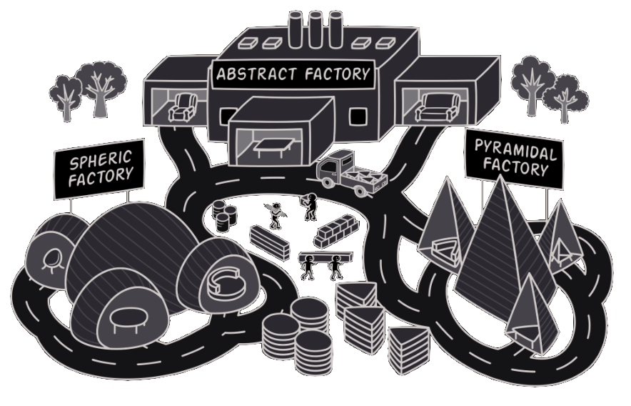
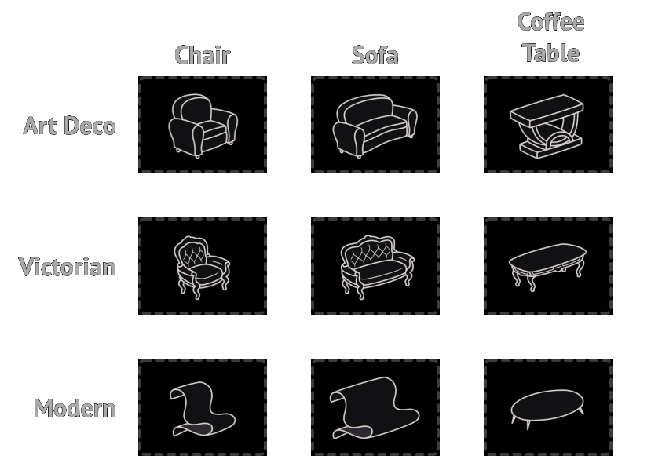
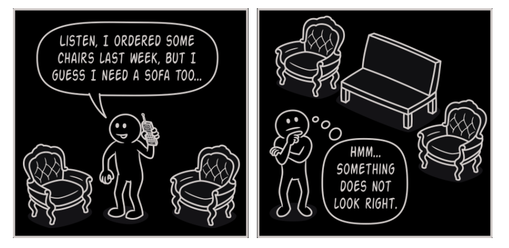
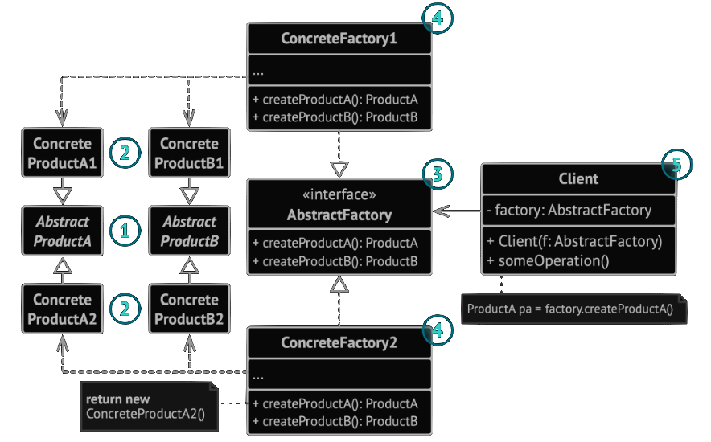
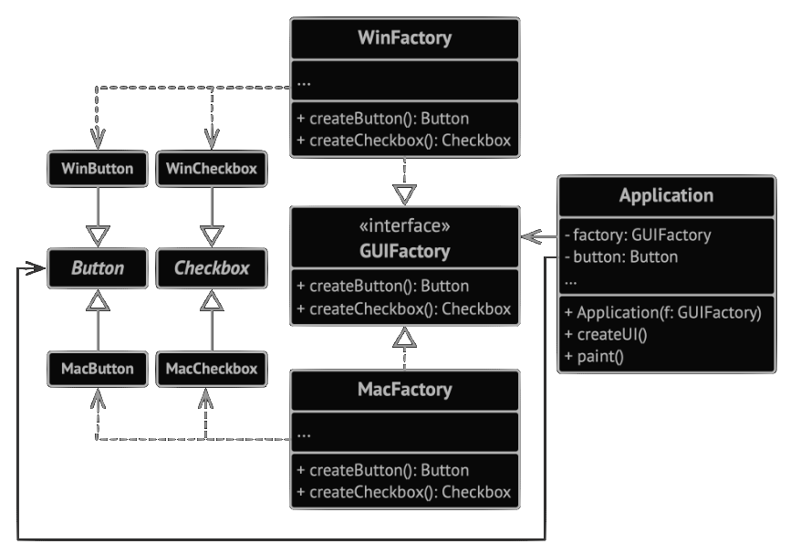

# Abtract Factory



Soyut Fabrika, somut sınıflarını belirtmeden birbiriyle ilişkili nesne aileleri üretmenizi sağlayan bir creational design patterndir.

## Problem

Bir mobilya magazasi yaptigimizi dusunelim. Asagidaki urunleri sergilemeniz gerekiyor:

1.  Urun gruplari, `Chair`, `Sofa`, `CoffeeTable`. (Sandalye, Kanepe, Kahve masasi)
2.  Urun gruplarinin cesitli turleri. Ornegin `Modern`, `Victorian`, `ArtDeco`.


> _Urun gruplari ve cesitli turleri._

Aynı turden diğer nesnelerle eşleşmeleri için tek tek mobilya nesneleri oluşturmanın bir yoluna ihtiyacınız var. Müşteriler eşleşmeyen mobilyalar aldıklarında oldukça sinirlenirler.

> _Modern Kanepe Victorian sandalye ile uyusmuyor._

Ayrıca, programa yeni ürünler veya ürün gruplari eklerken mevcut kodu değiştirmek istemezsiniz. Mobilya satıcıları kataloglarını çok sık günceller ve her seferinde çekirdek kodu değiştirmek istemezsiniz.

## Solution

Abstract Factory modelinin önerdiği ilk şey, ürün grubundaki her bir ürün (örneğin sandalye, kanepe veya sehpa) için arayüzleri önceden deklare etmektir. Daha sonra tüm ürün çeşitlerinin bu arayüzleri takip etmesini sağlayabilirsiniz. Örneğin, tüm sandalye çeşitleri `Chair` arayüzünü uygulayabilir; tüm sehpa çeşitleri `CoffeeTable` arayüzünü uygulayabilir vb.


> _Aynı nesnenin tüm varyantları tek bir sınıf hiyerarşisine taşınmalıdır._

Bir sonraki adım, ürün grubunun parçası olan tüm ürünler için (örneğin, `createChair` , `createSofa` ve `createCoffeeTable`) oluşturma yöntemlerinin bir listesini içeren bir arayüz olan **Abstract Factory**'yi deklare etmektir. Bu yöntemler, daha önce çıkardığımız arayüzler tarafından temsil edilen soyut ürün türlerini döndürmelidir: `Chair` , `Sofa` , `CoffeeTable` vb.

Peki ya ürün varyantları? Bir ürün grubunun her bir varyantı için `AbstractFactory` arayüzünü temel alan ayrı bir fabrika sınıfı oluşturuyoruz. Fabrika, belirli bir türde ürünler döndüren bir sınıftır. Örneğin, `ModernFurnitureFactory` yalnızca `ModernChair` , `ModernSofa` ve `ModernCoffeeTable` nesnelerini oluşturabilir.

> _Her somut fabrika belirli bir ürün varyantına karşılık gelir._

İstemci kodu hem fabrikalarla hem de ürünlerle ilgili abstract arayüzleri üzerinden çalışmalıdır. Bu, istemci koduna aktardığınız fabrikanın türünü ve istemci kodunun aldığı ürün çeşidini, gerçek istemci kodunu bozmadan değiştirmenize olanak tanır.

Diyelim ki müşteri bir fabrikanın bir sandalye üretmesini istiyor. İstemcinin fabrikanın sınıfından haberdar olması gerekmediği gibi ne tür bir sandalyeyi alacağı da önemli değildir. İster Modern bir model ister Viktorya tarzı bir sandalye olsun, istemci soyut `Chair` arayüzünü kullanarak tüm sandalyelere aynı şekilde davranmalıdır. Bu yaklaşımla, istemcinin sandalye hakkında bildiği tek şey, bir şekilde `sitOn` yöntemini uyguladığıdır. Ayrıca, sandalyenin hangi çeşidi döndürülürse döndürülsün, her zaman aynı fabrika nesnesi tarafından üretilen kanepe veya sehpa türüyle eşleşecektir.

## Structure



1. **Soyut Ürünler**, bir ürün ailesini oluşturan bir dizi farklı ancak ilgili ürün için arayüzler bildirir.
2. **Somut Ürünler**, soyut ürünlerin varyantlara göre gruplandırılmış çeşitli uygulamalarıdır. Her soyut ürün (sandalye/kanepe) verilen tüm varyantlarda (Viktorya Dönemi/Modern) uygulanmalıdır.
3. **Soyut Fabrika arayüzü**, soyut ürünlerin her birini oluşturmak için bir dizi yöntem bildirir.
4. **Somut Fabrikalar**, soyut fabrikanın oluşturma yöntemlerini uygular. Her somut fabrika belirli bir ürün çeşidine karşılık gelir ve yalnızca bu ürün çeşitlerini oluşturur.
5. Somut fabrikalar somut ürünleri örneklendirse de, oluşturma yöntemlerinin imzaları karşılık gelen soyut ürünleri döndürmelidir. Bu şekilde, bir fabrika kullanan istemci kodu, fabrikadan aldığı ürünün belirli bir çeşidine bağlanmaz. **İstemci**, nesneleriyle soyut arayüzler aracılığıyla iletişim kurduğu sürece herhangi bir somut fabrika/ürün çeşidiyle çalışabilir.

## Pseudocode

Bu örnek, Abstract Factory modelinin, istemci kodunu somut UI sınıflarına bağlamadan platformlar arası UI öğeleri oluşturmak için nasıl kullanılabileceğini gösterirken, oluşturulan tüm öğeleri seçilen bir işletim sistemiyle tutarlı tutar.



Platformlar arası bir uygulamadaki aynı kullanıcı arayüzü öğelerinin benzer şekilde davranması, ancak farklı işletim sistemlerinde biraz farklı görünmesi beklenir. Dahası, kullanıcı arayüzü öğelerinin mevcut işletim sisteminin stiliyle eşleştiğinden emin olmak sizin işinizdir. Programınızın Windows'ta çalıştırıldığında macOS kontrollerini oluşturmasını istemezsiniz.

Abstract Factory arayüzü, istemci kodunun farklı türde UI öğeleri üretmek için kullanabileceği bir dizi oluşturma yöntemi bildirir. Somut fabrikalar belirli işletim sistemlerine karşılık gelir ve söz konusu işletim sistemiyle eşleşen kullanıcı arayüzü öğelerini oluşturur.

İstemci kodu, bu nesnelerle soyut arayüzleri aracılığıyla çalıştığı sürece fabrikaların ve kullanıcı arayüzü öğelerinin somut sınıflarına bağlı değildir. Bu aynı zamanda istemci kodunun gelecekte ekleyebileceğiniz diğer fabrikaları veya UI öğelerini desteklemesini sağlar.

Sonuç olarak, uygulamanıza yeni bir UI öğesi varyasyonu eklediğinizde istemci kodunu değiştirmeniz gerekmez. Tek yapmanız gereken bu öğeleri üreten yeni bir fabrika sınıfı oluşturmak ve uygun olduğunda bu sınıfı seçmesi için uygulamanın başlatma kodunu biraz değiştirmektir.

```csharp
// Abtract Factory arayüzü, farklı soyut ürünler döndüren bir dizi metod bildirir.
// Bu ürünler bir grup olarak adlandırılır ve yüksek seviyeli bir tema veya kavramla ilişkilidir.
// Bir grubun ürünleri genellikle kendi aralarında işbirliği yapabilir.
// Ürünlerin bir grubu birden fazla çeşide sahip olabilir,
// ancak bir çeşidin ürünleri başka bir çeşidin ürünleriyle uyumsuzdur.
interface GUIFactory is
    method createButton():Button
    method createCheckbox():Checkbox

// Somut fabrikalar, tek bir çeşide ait ürün ailesini üretir.
// Fabrika, üretilen ürünlerin uyumlu olduğunu garanti eder.
// Somut fabrikanın metod imzaları bir soyut ürün döndürürken,
// metodun içinde somut bir ürün örneklendirilir.
class WinFactory implements GUIFactory is
    method createButton():Button is
        return new WinButton()
    method createCheckbox():Checkbox is
        return new WinCheckbox()

// Her somut fabrikanın karşılık gelen bir ürün çeşidi vardır.
class MacFactory implements GUIFactory is
    method createButton():Button is
        return new MacButton()
    method createCheckbox():Checkbox is
        return new MacCheckbox()

// Her ürün ailesinin farklı ürünleri için bir temel arayüz olmalıdır.
// Ürünün tüm çeşitleri bu arayüzü uygulamalıdır.
interface Button is
    method paint()

// Somut ürünler, karşılık gelen somut fabrikalar tarafından oluşturulur.
class WinButton implements Button is
    method paint() is
        // Windows tarzında bir buton renderla.

class MacButton implements Button is
    method paint() is
        // macOS tarzında bir buton renderla.

// İşte başka bir ürünün temel arayüzü. Tüm ürünler birbirleriyle etkileşimde bulunabilir,
// ancak uygun etkileşim yalnızca aynı somut çeşidin ürünleri arasında mümkündür.
interface Checkbox is
    method paint()

class WinCheckbox implements Checkbox is
    method paint() is
        // Windows tarzında bir onay kutusu renderla.

class MacCheckbox implements Checkbox is
    method paint() is
        // macOS tarzında bir onay kutusu renderla.

// İstemci kodu, fabrikalar ve ürünlerle yalnızca soyut tipler aracılığıyla çalışır:
// GUIFactory, Button ve Checkbox. Bu, herhangi bir fabrika veya ürün alt sınıfını
// istemci koduna kırmadan geçirmenize olanak tanır.
class Application is
    private field factory: GUIFactory
    private field button: Button
    constructor Application(factory: GUIFactory) is
        this.factory = factory
    method createUI() is
        this.button = factory.createButton()
    method paint() is
        button.paint()

// Uygulama, geçerli yapılandırmaya veya ortam ayarlarına bağlı olarak
// fabrika tipini seçer ve bunu çalışma zamanında (genellikle başlangıç aşamasında) oluşturur.
class ApplicationConfigurator is
    method main() is
        config = readApplicationConfigFile(s)

        if (config.OS == "Windows") then
            factory = new WinFactory()
        else if (config.OS == "Mac") then
            factory = new MacFactory()
        else
            throw new Exception("Hata! Bilinmeyen işletim sistemi.")

        Application app = new Application(factory)
```

## How to Implement
1. Farklı ürün tipleri ve bu ürünlerin varyantlarından oluşan bir matris oluşturun.
2. Tüm ürün türleri için soyut ürün arayüzleri tanımlayın. Ardından tüm somut ürün sınıflarının bu arayüzleri uygulamasını sağlayın.
3. Tüm soyut ürünler için bir dizi oluşturma yöntemiyle birlikte soyut fabrika arayüzünü deklare edin.
4. Her ürün çeşidi için bir tane olmak üzere bir dizi somut fabrika sınıfı uygulayın.
5. Uygulamanın bir yerinde fabrika başlatma kodu oluşturun. Uygulama yapılandırmasına veya mevcut ortama bağlı olarak somut fabrika sınıflarından birini örneklemelidir. Bu fabrika nesnesini ürün oluşturan tüm sınıflara aktarın.
6. Kodu tarayın ve ürün kurucularına yapılan tüm doğrudan çağrıları bulun. Bunları fabrika nesnesi üzerindeki uygun oluşturma yöntemine yapılan çağrılarla değiştirin.

## Applicability
* **Kodunuzun çeşitli ilgili ürün gruplarıyla çalışması gerektiğinde Abstract Factory'yi kullanın, ancak bu ürünlerin somut sınıflarına bağlı olmasını istemezsiniz - bunlar önceden bilinmeyebilir veya sadece gelecekte genişletilebilirliğe izin vermek istersiniz.**

  Abstract Factory, ürün grubunun her sınıfından nesneler oluşturmanız için size bir arayüz sağlar. Kodunuz nesneleri bu arayüz aracılığıyla oluşturduğu sürece, uygulamanız tarafından zaten oluşturulmuş ürünlerle eşleşmeyen bir ürünün yanlış varyantını oluşturma konusunda endişelenmenize gerek yoktur.

* **Birincil sorumluluğunu bulanıklaştıran bir dizi [Factory Metod](https://github.com/kuvarti/DesignPattern/blob/main/CatalogOfDesignPatterns/CreationalDesignPatterns/FactoryMethod/README.md)una sahip olduğunuzda Abstract Factory'yi uygulamayabilirsiniz.**

  İyi tasarlanmış bir programda _her sınıf sadece tek bir şeyden sorumludur_. Bir sınıf birden fazla ürün türüyle ilgilendiğinde, fabrika yöntemlerini bağımsız bir fabrika sınıfına veya tam gelişmiş bir Abstract Factory uygulamasına çıkarmaya değer olabilir.

## Pros and Cons
[+] Bir fabrikadan aldığınız ürünlerin birbiriyle uyumlu olduğundan emin olabilirsiniz.\
[+] Somut ürünler ve istemci kodu arasında sıkı bağlantıdan kaçınırsınız. \
[+] Single Responsibility Principle. Ürün oluşturma kodunu tek bir yerde toplayarak kodun desteklenmesini kolaylaştırabilirsiniz. \
[+] Open/Closed Principle. Mevcut istemci kodunu bozmadan yeni ürün varyantları ekleyebilirsiniz. \
[-] Kalıpla birlikte çok sayıda yeni arayüz ve sınıf tanıtıldığı için kod olması gerekenden daha karmaşık hale gelebilir.\

## Relations with Other Patterns
- Birçok tasarım [Factory Metod](https://github.com/kuvarti/DesignPattern/blob/main/CatalogOfDesignPatterns/CreationalDesignPatterns/FactoryMethod/README.md) (daha az karmaşık ve alt sınıflar aracılığıyla daha özelleştirilebilir) kullanarak başlar ve [Abstract Factory](#), [Prototype] veya [Builder]'a (daha esnek, ancak daha karmaşık) doğru gelişir.
- [Builder], karmaşık nesneleri adım adım oluşturmaya odaklanır. [Abstract Factory](#), ilgili nesnelerin ailelerini oluşturma konusunda uzmanlaşmıştır. [Abstract Factory](#) ürünü hemen döndürürken, [Builder] ürünü almadan önce bazı ek yapım adımlarını çalıştırmanıza izin verir.
- Soyut Fabrika sınıfları genellikle bir dizi [Factory Metod](https://github.com/kuvarti/DesignPattern/blob/main/CatalogOfDesignPatterns/CreationalDesignPatterns/FactoryMethod/README.md)una dayanır, ancak bu sınıflardaki metotları oluşturmak için [Prototype] da kullanabilirsiniz.
- [Abstract Factory](#), yalnızca alt sistem nesnelerinin oluşturulma şeklini istemci kodundan gizlemek istediğinizde [Facade]'e bir alternatif olarak kullanılabilir.
- [Abstract Factory](#)'yi Bridge ile birlikte kullanabilirsiniz. Bu eşleştirme, [Bridge] tarafından tanımlanan bazı soyutlamalar yalnızca belirli uygulamalarla çalışabildiğinde kullanışlıdır. Bu durumda, [Abstract Factory](#) bu ilişkileri kapsülleyebilir ve karmaşıklığı istemci kodundan gizleyebilir.
- [Abstract Factory](#), [Builder] ve [Prototype]'larin tümü [Singleton] olarak uygulanabilir.