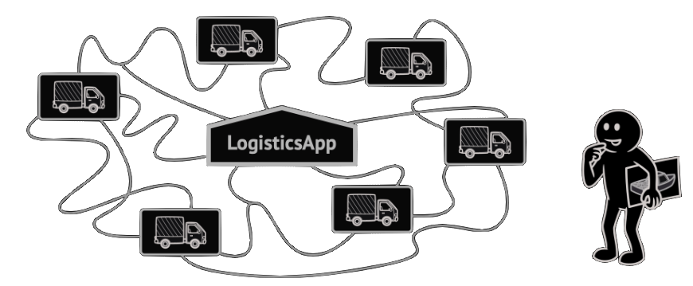
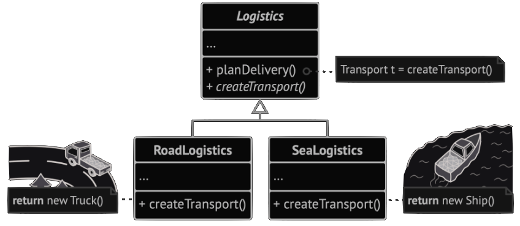
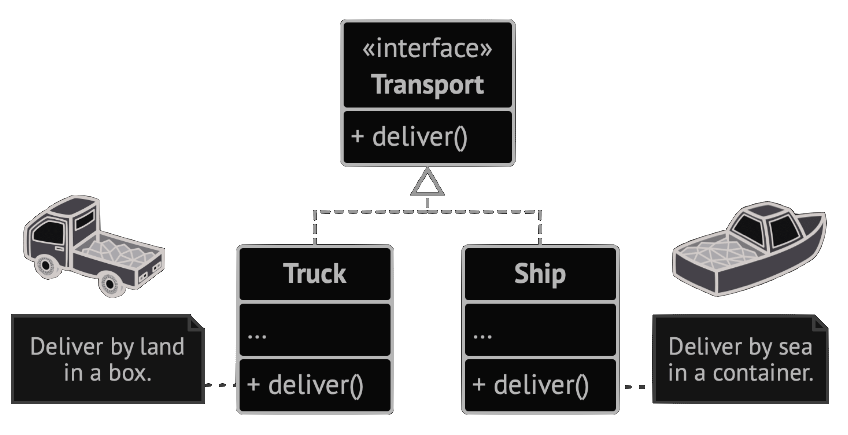
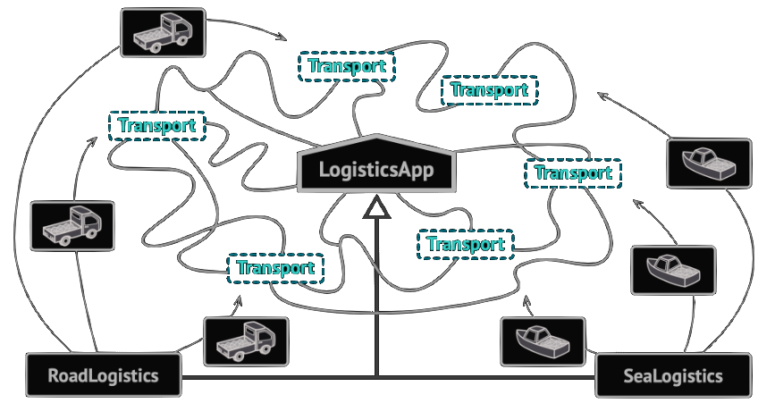
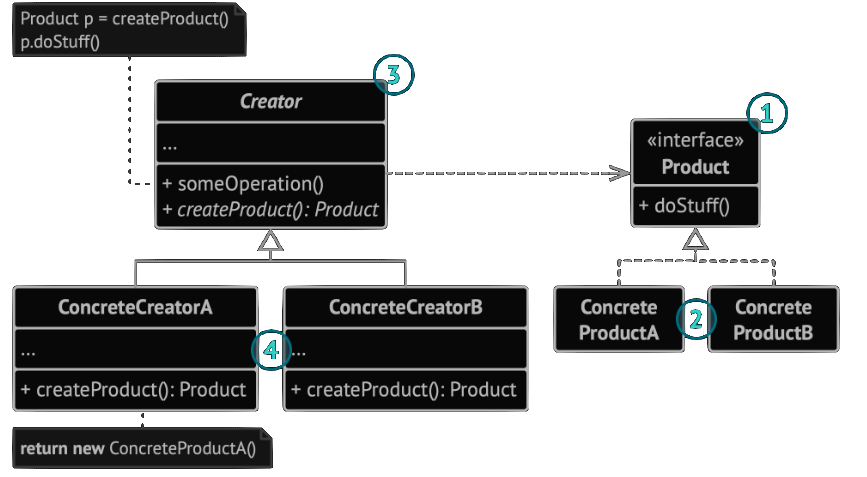
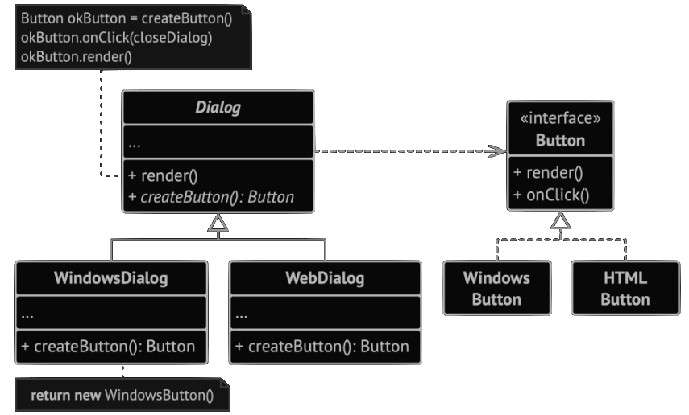

# Factory Method | **AKA** Virtual Constructor
<!-- -->


Factory Method, bir üst sınıfta nesneler oluşturmak için bir arayüz sağlayan, ancak alt sınıfların oluşturulacak nesnelerin türünü değiştirmesine izin veren bir Creational Design Pattern dir.

## Problem

Bir lojistik yönetim uygulaması oluşturduğunuzu düşünün. Uygulamanızın ilk sürümü yalnızca kamyonlarla taşımacılık yapabiliyor, bu nedenle kodunuzun büyük kısmı `Truck` sınıfının içinde yer alıyor.

Bir süre sonra uygulamanız oldukça popüler hale gelir. Her gün deniz taşımacılığı şirketlerinden deniz lojistiğini uygulamaya dahil etmek için onlarca talep alıyorsunuz.


> _Kodun geri kalanı zaten mevcut sınıflara bağlıysa, programa yeni bir sınıf eklemek o kadar da kolay değildir._

Mukemmel, degil mi? Şu anda kodunuzun çoğu `Truck` sınıfına bağlı. Uygulamaya `Ship` eklemek, tüm kod tabanında değişiklik yapmayı gerektirecektir. Dahası, daha sonra uygulamaya başka bir ulaşım türü eklemeye karar verirseniz, muhtemelen tüm bu değişiklikleri yeniden yapmanız gerekecektir.

## Solution
Factory Method, doğrudan nesne oluşturma çağrılarını (`new` operatörünü kullanarak) özel bir factory method ile yapılan çağrılarla değiştirmenizi önerir. Endişelenmeyin: nesneler hala `new` işleci aracılığıyla oluşturulur, ancak bu işleç factory method  içerisinden çağrılır. Bir factory method tarafından döndürülen nesneler genellikle `Product` olarak adlandırılır.

> _Alt sınıflar, factory method tarafından döndürülen nesnelerin sınıfını değiştirebilir._

İlk bakışta bu değişiklik anlamsız görünebilir: sadece kurucu çağrısını programın bir bölümünden diğerine taşıdık. Ancak şunu düşünün: artık bir alt sınıfta fabrika yöntemini geçersiz kılabilir ve yöntem tarafından oluşturulan ürünlerin sınıfını değiştirebilirsiniz.

Ancak küçük bir sınırlama vardır: alt sınıflar, yalnızca bu ürünler ortak bir temel sınıfa veya arayüze sahipse farklı ürün türleri döndürebilir. Ayrıca, temel sınıftaki fabrika yönteminin dönüş türü bu arayüz olarak bildirilmelidir.


> _Butun Siniflar ayni arayuze uymalidir._

Örneğin, hem `Truck` hem de `Ship` sınıfları, deliver adında bir yöntem bildiren `Transport` arayüzünü uygulamalıdır. Her sınıf bu yöntemi farklı şekilde uygular: kamyonlar kargoyu karadan, gemiler kargoyu denizden teslim eder. `RoadLogistics` sınıfındaki fabrika yöntemi `Truck` nesneleri döndürürken, `SeaLogistics` sınıfındaki fabrika yöntemi `Ship` nesneleri döndürür.

Factory Method kullanan kod (genellikle istemci kodu olarak adlandırılır), çeşitli alt sınıflar tarafından döndürülen gerçek ürünler arasında bir fark görmez. İstemci tüm ürünleri soyut Taşıma olarak ele alır.


> _Tüm ürün sınıfları ortak bir arayüz uyguladığı sürece, nesnelerini istemci koduna bozmadan aktarabilirsiniz._

İstemci, tüm taşıma nesnelerinin `deliver` yöntemine sahip olması gerektiğini bilir, ancak bunun tam olarak nasıl çalıştığı istemci için önemli değildir.

## Structure


1. **Product**, oluşturucu ve alt sınıfları tarafından üretilebilecek tüm nesneler için ortak olan arayüzü bildirir.
2. **Concrete Products**, ürün arayüzünün farklı uygulamalarıdır.
3. **Creator** sınıfı, yeni ürün nesneleri döndüren factory method'u bildirir. Bu yöntemin dönüş türünün ürün arayüzüyle eşleşmesi önemlidir.
   Tüm alt sınıfları yöntemin kendi sürümlerini uygulamaya zorlamak için fabrika yöntemini `abstract` olarak bildirebilirsiniz. Alternatif olarak, temel fabrika yöntemi bazı varsayılan ürün türlerini döndürebilir.
   > Adına rağmen ürün oluşturma, oluşturucunun birincil sorumluluğu değildir. Genellikle, Creator sınıf zaten ürünlerle ilgili bazı temel iş mantığına sahiptir. factory method, bu mantığı absstract ürün sınıflarından ayırmaya yardımcı olur. Şöyle bir benzetme yapabiliriz: büyük bir yazılım geliştirme şirketinin programcılar için bir eğitim departmanı olabilir. Ancak, şirketin bir bütün olarak birincil işlevi hala kod yazmaktır, programcı üretmek değil.
4. **Concrete Creator**'lar temel fabrika yöntemini geçersiz kılarak farklı bir ürün türü döndürür.

Factory Method'un her zaman yeni örnekler oluşturmak zorunda olmadığını unutmayın. Ayrıca bir önbellekten, nesne havuzundan veya başka bir kaynaktan mevcut nesneleri de döndürebilir.

## Pseudocode
Bu örnek, istemci kodunu somut UI sınıflarına bağlamadan platformlar arası UI öğeleri oluşturmak için factory method'un nasıl kullanılabileceğini göstermektedir.

Temel `Dialog` sınıfı, penceresini oluşturmak için farklı UI öğeleri kullanır. Çeşitli işletim sistemleri altında bu öğeler biraz farklı görünebilir, ancak yine de tutarlı davranmaları gerekir. Windows'taki bir düğme Linux'ta hala bir düğmedir.


> _Çapraz platform diyalog örneği._

Factory method devreye girdiğinde, `Dialog` sınıfının mantığını her işletim sistemi için yeniden yazmanıza gerek kalmaz. Temel `Dialog` sınıfının içinde buttonlar üreten bir factory method tanımlarsak, daha sonra factory method'dan Windows tarzı buttonlar döndüren bir alt sınıf oluşturabiliriz. Alt sınıf daha sonra kodun çoğunu temel sınıftan miras alır, ancak factory method sayesinde ekranda Windows görünümlü buttonlar oluşturabilir.

Bu modelin çalışması için, temel `Dialog` sınıfının abstract buttonlarla çalışması gerekir: tüm somut buttonlarin takip ettiği bir temel sınıf veya bir arayüz. Bu şekilde, `Dialog` içindeki kod, hangi tür buttonlarla çalışırsa çalışsın işlevsel kalır.

Elbette, bu yaklaşımı diğer UI öğelerine de uygulayabilirsiniz. Ancak, `Dialog`'a eklediğiniz her yeni factory method ile [Abstract Factory](#) modeline daha da yaklaşırsınız. Korkmayın, bu pattern hakkında daha sonra konuşacağız.

```csharp
// Yaratıcı sınıf, bir ürün sınıfının bir nesnesini döndürmesi gereken factory methodu tanımlar.
// Yaratıcının alt sınıfları genellikle bu metodu uygular.
class Dialog is
    // Yaratıcı, factory methodunun bazı varsayılan uygulamalarını da sağlayabilir.
    abstract method createButton():Button

    // Adından da anlaşılabileceği gibi, yaratıcının asıl sorumluluğu ürün oluşturmak değildir. 
    //Genellikle factory methodundan dönen ürün nesnelerine dayanan bazı temel iş mantıklarını içerir. 
    //Alt sınıflar, factory metodunu geçersiz kılarak ve ondan farklı bir tür ürün döndürerek dolaylı olarak bu iş mantığını değiştirebilir.
    method render() is
        // Ürün nesnesi oluşturmak için factory methodunu çağır.
        Button okButton = createButton()
        // Şimdi ürünü kullan.
        okButton.onClick(closeDialog)
        okButton.render()

// Somut yaratıcılar, sonuçlanan ürünün türünü değiştirmek için factory methodunu geçersiz kılar.
class WindowsDialog extends Dialog is
    method createButton():Button is
        return new WindowsButton()

class WebDialog extends Dialog is
    method createButton():Button is
        return new HTMLButton()

// Ürün arayüzü, tüm somut ürünlerin uygulaması gereken işlemleri belirtir.
interface Button is
    method render()
    method onClick(f)

// Somut ürünler, ürün arayüzünün çeşitli uygulamalarını sağlar.
class WindowsButton implements Button is
    method render(a, b) is
        // Windows tarzında bir buton oluştur.
    method onClick(f) is
        // Yerel OS tıklama olayını bağla.

class HTMLButton implements Button is
    method render(a, b) is
        // Bir butonun HTML temsilini döndür.
    method onClick(f) is
        // Bir web tarayıcı tıklama olayını bağla.

class Application is
    field dialog: Dialog

    // Uygulama, mevcut yapılandırma veya ortam ayarlarına bağlı olarak bir yaratıcı türü seçer.
    method initialize() is
        config = readApplicationConfigFile()

        if (config.OS == "Windows") then
            dialog = new WindowsDialog()
        else if (config.OS == "Web") then
            dialog = new WebDialog()
        else
            throw new Exception("Error! Unknown operating system.")

// İstemci kodu, somut bir yaratıcı örneği ile çalışır, ancak temel arayüzü aracılığıyla.
// İstemci, yaratıcıyla temel arayüz üzerinden çalışmaya devam ettiği sürece,
// herhangi bir yaratıcı alt sınıfını geçebilirsiniz.
method main() is
    this.initialize()
    dialog.render()
```

## How to Implement
1. Tüm ürünlerin aynı arayüzü kullanması sağlanmalıdır. Bu arayüz, her üründe anlamlı olan yöntemleri bildirmelidir.
2. Creator sınıfının içine boş bir factory metodu ekleyin. Metodun dönüş tipi ortak ürünlerin arayüzüyle eşleşmelidir.
3. Oluşturucunun kodunda ürün kurucularına yapılan tüm referansları bulun. Ürün oluşturma kodunu factory metoduna eklerken bunları teker teker factory metoduna yapılan çağrılarla değiştirin.

   Dönen ürünün türünü kontrol etmek için factory metoduna geçici bir parametre eklemeniz gerekebilir.
4. Şimdi, factory metodunda listelenen her ürün türü için bir dizi oluşturucu alt sınıfı oluşturun. Alt sınıflarda factory metodunu geçersiz kılın ve temel metottan uygun yapı kodu parçalarını çıkarın.
5. Çok fazla ürün türü varsa ve hepsi için alt sınıflar oluşturmak mantıklı değilse, alt sınıflarda temel sınıftaki kontrol parametresini yeniden kullanabilirsiniz.
6. Tüm çıkarma işlemlerinden sonra temel fabrika yöntemi boş hale gelirse, onu soyut hale getirebilirsiniz. Geriye bir şey kalırsa, bunu yöntemin varsayılan davranışı haline getirebilirsiniz.

## Applicability

* **Kodunuzun birlikte çalışması gereken nesnelerin tam türlerini ve bağımlılıklarını önceden bilmiyorsanız Factory Method'u kullanın.**

  Factory Method, ürün oluşturma kodunu ürünü gerçekten kullanan koddan ayırır. Bu nedenle, ürün yapım kodunu kodun geri kalanından bağımsız olarak genişletmek daha kolaydır.

  Örneğin, uygulamaya yeni bir ürün türü eklemek için yalnızca yeni bir oluşturucu alt sınıfı oluşturmanız ve içindeki fabrika yöntemini geçersiz kılmanız gerekir.

* **Kütüphanenizin veya framework'ünüzün kullanıcılarına dahili bileşenlerini genişletmek için bir yol sağlamak istediğinizde Factory Method'u kullanın.**

  Kalıtım, bir kütüphane veya framework'ün varsayılan davranışını genişletmenin muhtemelen en kolay yoludur. Ancak framework, standart bir bileşen yerine alt sınıfınızın kullanılması gerektiğini nasıl anlayacaktır?

  Çözüm, framework genelinde bileşenleri oluşturan kodu tek bir factory metoduna indirgemek ve bileşenin kendisini genişletmenin yanı sıra herkesin bu metodu geçersiz kılmasına izin vermektir.

* **Her seferinde yeniden oluşturmak yerine mevcut nesneleri yeniden kullanarak sistem kaynaklarından tasarruf etmek istediğinizde Factory Method'u kullanın.**

  Bu ihtiyacı genellikle veritabanı bağlantıları, dosya sistemleri ve ağ kaynakları gibi büyük, yoğun kaynak gerektiren nesnelerle uğraşırken yaşarsınız.

  Mevcut bir nesneyi yeniden kullanmak için ne yapılması gerektiğini düşünelim:
  1. Öncelikle, oluşturulan tüm nesnelerin kaydını tutmak için bir depolama alanı oluşturmanız gerekir.
  2. Birisi bir nesne talep ettiğinde, program bu havuz içinde boş bir nesne aramalıdır.
  3. ... ve ardından istemci koduna geri döndürün.
  4. Boş nesne yoksa, program yeni bir nesne oluşturmalı (ve havuza eklemelidir).

  Bu çok fazla kod demek. Ve hepsinin tek bir yere konması gerekir, böylece programı yinelenen kodlarla kirletmezsiniz.

  Muhtemelen bu kodun yerleştirilebileceği en belirgin ve uygun yer, nesnelerini yeniden kullanmaya çalıştığımız sınıfın kurucusudur. Ancak, bir kurucu tanım gereği her zaman yeni nesneler döndürmelidir. Mevcut örnekleri döndüremez. Bu nedenle, mevcut nesneleri yeniden kullanmanın yanı sıra yeni nesneler de oluşturabilen normal bir yönteme sahip olmanız gerekir. Bu bir fabrika yöntemine çok benziyor.

## Pros and Cons
[+] Yaratıcı ile somut ürünler arasında sıkı bir bağlantı oluşmasını önlersiniz.\
[+] Single Responsibility Principle. Ürün oluşturma kodunu programda tek bir yere taşıyarak kodun desteklenmesini kolaylaştırabilirsiniz.\
[+] Open/Closed Principle, Mevcut istemci kodunu bozmadan programa yeni ürün türleri ekleyebilirsiniz.\
[-] Kalıbı uygulamak için çok sayıda yeni alt sınıf eklemeniz gerektiğinden kod daha karmaşık hale gelebilir. En iyi senaryo, kalıbı mevcut bir yaratıcı sınıflar hiyerarşisine dahil ettiğiniz durumdur.\

## Relations with Other Patterns
* Birçok tasarım [Factory Method](#) (daha az karmaşık ve alt sınıflar aracılığıyla daha özelleştirilebilir) kullanarak başlar ve [Abstract Factory], [Prototype] veya [Builder]'a (daha esnek, ancak daha karmaşık) doğru gelişir.
* [Abstract Factory] sınıfları genellikle bir dizi [Factory Metoduna](#) dayanır, ancak bu sınıflardaki metotları oluşturmak için [Prototype] da kullanabilirsiniz.
* [Prototype] kalıtıma dayalı değildir, bu nedenle dezavantajları yoktur. Öte yandan, Prototype klonlanan nesnenin karmaşık bir şekilde başlatılmasını gerektirir. [Factory Method](#) kalıtıma dayanır ancak bir başlatma adımı gerektirmez.
* [Factory Metoduna](#), [Template Method]'un özelleştirilmiş halidir. Aynı zamanda, bir _Factory Metodu_ büyük bir _Template Metodunda_ bir adım olarak hizmet edebilir.