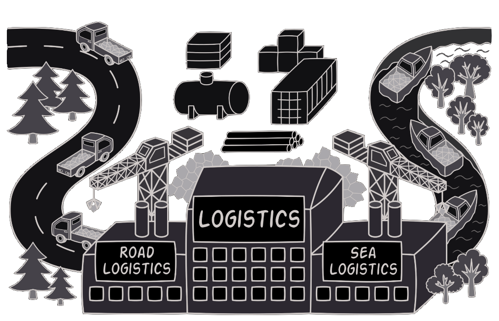

# Factory Method | **AKA** Virtual Constructor
<!-- https://github.com/kuvarti/DesignPattern/blob/main/attachments/img/specials/FactoryMethod/FactoryMethod.png -->

Factory Method, bir üst sınıfta nesneler oluşturmak için bir arayüz sağlayan, ancak alt sınıfların oluşturulacak nesnelerin türünü değiştirmesine izin veren bir Creational Design Pattern dir.

## Problem