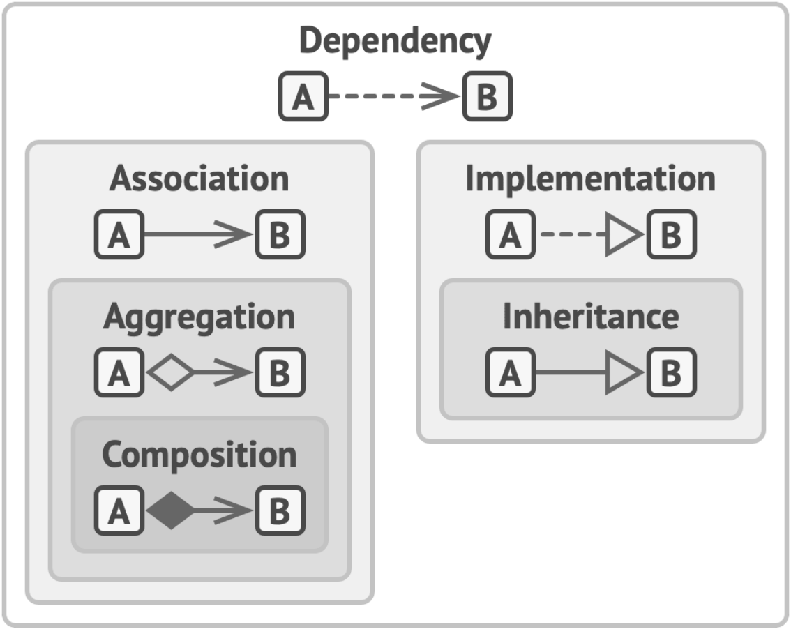
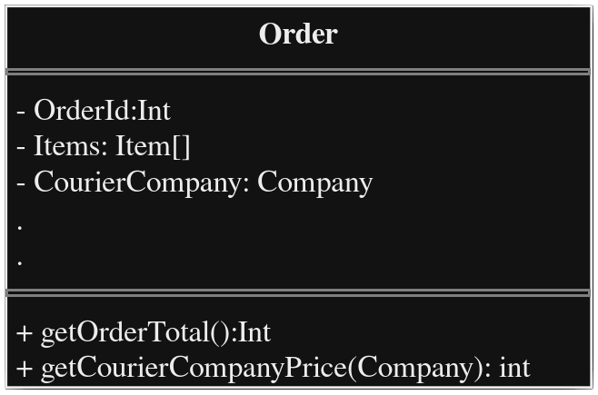
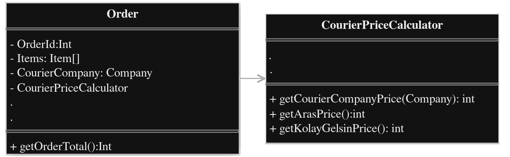
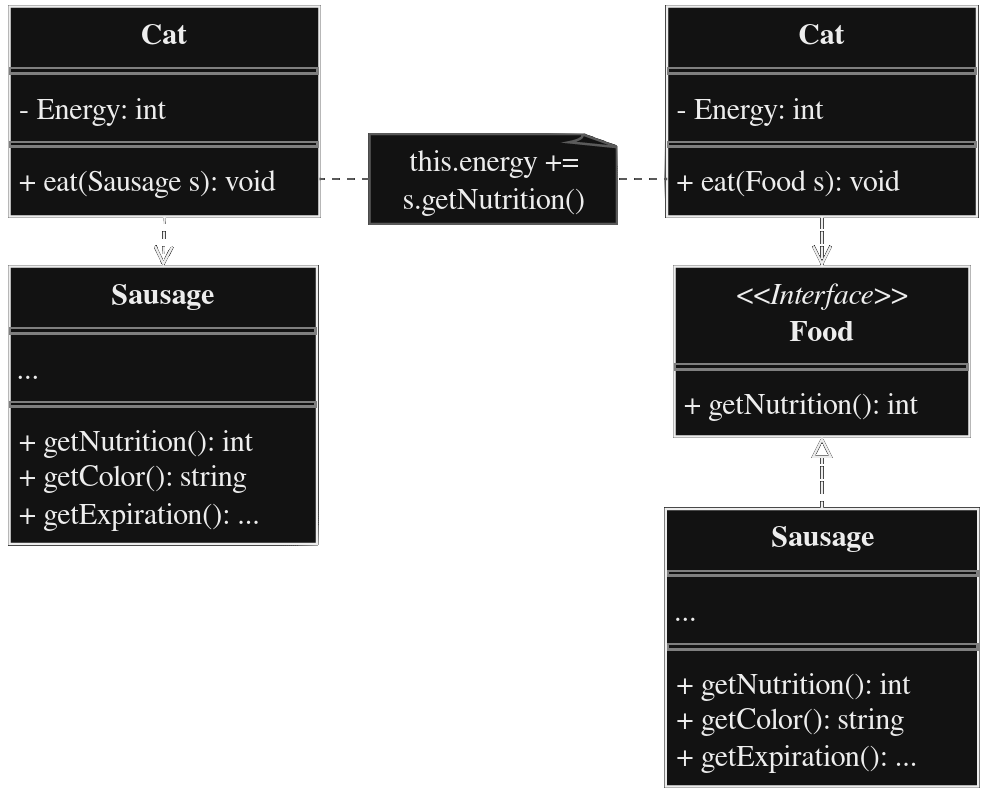
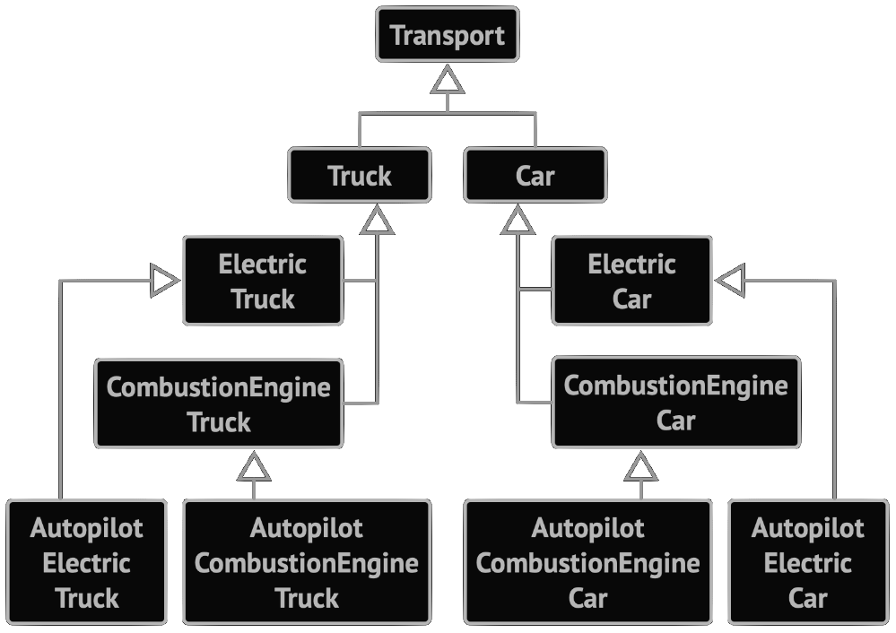
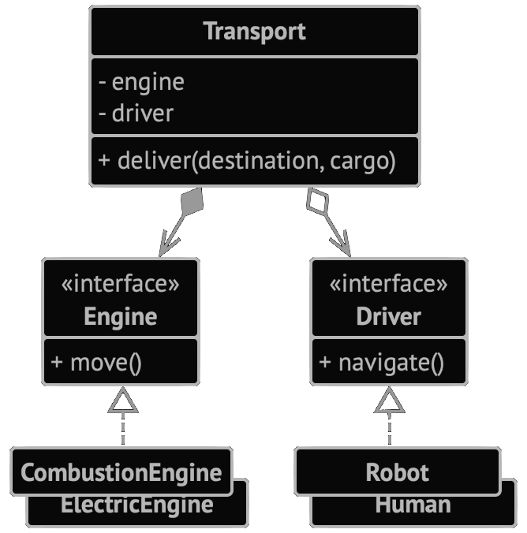
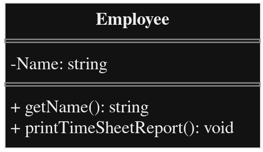
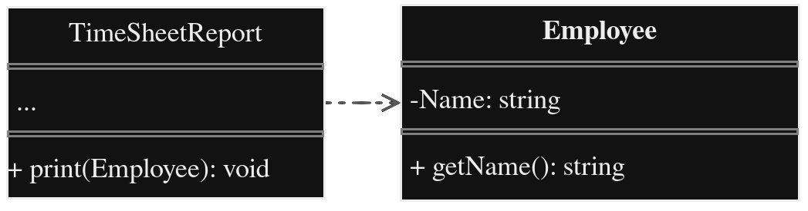

# INTRODUCTION TO OOP
>Kaynak: [refactoring.guru](https://refactoring.guru)

.
.
.

## Pillars of OOP

### 1) Abstraction(Soyutlama)
En basit anlatim ile objenin modellenmesidir. Abstrac Classlar yalnızca belirli bir bağlamda gerçek nesnelerin niteliklerini ve davranışlarını modeller, geri kalanını göz ardı eder.

### 2) Encapsulation(Kapsulleme)
Her nesnenin bir arayuzu vardir, icerisinde yapilan islemleri diger nesnelere sunar. Encapsilation bu arayuzu kurgulamak icin kullanilir, gizlenmesi gerekenler `private` olarak nitelendirir ve gerekli prosedurler ile diger nesnelerden erisilmesini saglar.
>Cogu dildeki `Interface` ve `Abstract Classes/Methods` kavramlari Kapsullemeye baglidir.

### 3) Inheritance (Kalitim)
Nesneler uzerinden yeni nesneler uretmek icin kullanilir.Benzer isi yapan farkli Objeler var ise bir ana nesne altinda farkliliklarina gore kendi methodlarini bulunduran yeni nesneler olusturulur.

Eksi yani yeni uretilen Nesne Turetilen Nesnenin arayuzunu(Interface) bulundurmak zorundadir.

### 4) Polymorphism (Cok Sekillilik)
Nesnenin gercek sinifini kullanarak, kendisinden bagimsiz olarak gercek sinif ozelligini kullanmak icin kullanilir.
> **Gercek Sinif :** Objenin turetildigi ana Obje demektir. OR: Canli sinifindan Insan Sinifi turetilirse Insan'in gercek sinifi Canli olur.

## Relations Between Objects

### Dependency (Bagimlilik)

> _Professor Course Metaryellerine bagimli._

Siniflar arasi en basit ve zayif baglanti sekli. Bir sınıfın tanımında yapılan bazı değişiklikler diğer sınıfta da değişikliklere neden olabiliyorsa iki sınıf arasında bağımlılık vardır.

### Association (İlişkilendirme)

> _Professor Student ile iletisim sagliyor._

Genel olarak, başka bir nesneyi içeren bir alanı temsil etmek için bir ilişkilendirme kullanırsınız. Bu alan iki nesne arasında bir bağlantı görevi görür. Ancak her zaman bir alan olmak zorunda değildir. İlişkilendirme, bir nesne döndüren bir yöntemle de temsil edilebilir. Aksi takdirde, arayüzler arasında ilişkilendirme kullanmak mümkün olmazdı (arayüzlerde alan olmadığı için).

### Aggregation (Kümeleme)

> _Department Professor iceriyor._

kümeleme, birden fazla nesne arasındaki "bire-çok", "çoğa-çok" veya "bütün-parça" ilişkilerini temsil eden özel bir ilişkilendirme türüdür. 

Genellikle, kümeleme altında, bir nesne bir dizi başka nesneye "sahiptir" ve bir kap veya koleksiyon olarak hizmet eder. Bileşen, konteyner olmadan var olabilir ve aynı anda birkaç konteynere bağlanabilir.

### Composition (Kompozisyon)

> _University Departmentlerden olusuyor._

Kompozisyon, bir nesnenin diğerinin bir veya daha fazla örneğinden oluştuğu özel bir toplama türüdür. Bu ilişki ile diğerleri arasındaki fark, bileşenin yalnızca kabın bir parçası olarak var olabilmesidir.

## The Big Picture
Butun iliski cesitlerini gorduk. simdide birlikte nasil baglandigina bakalim.

* **Dependency :** A sinifi B sinifindaki degisikliklerden etkilenir.
* **Association :** A objesi B objesini taniyor. A sinifi B'ye bagli.
* **Aggregation :** A objesi B objesini taniyor ve B'den olusuyor. A sinifi Bye bagli.
* **Composition :** A objesi B objesini taniyor, B'den olusuyor ve B'nin dongusunu yonetiyor. A sinifi B'ye bagli.
* **Implementation :** А sınıfı, B arayüzünde bildirilen yöntemleri tanımlar. A nesneleri B olarak ele alınabilir. A sınıfı B'ye bağlıdır.
* **Inheritance :** A sinifi B'nin arayuzu dahil butun methodlarini tanimlar ve genisletebilir. A nesneleri B olarak ele alınabilir. A sınıfı B'ye bağlıdır.


> _Zayiftan Gucluye dogru Obje ve sinif iliskileri._

# INTRODUCTION TO PATTERNS

## What's a Design Pattern?
Design Patternlar, yazılım tasarımında yaygın olarak ortaya çıkan sorunlara yönelik tipik çözümlerdir. Kodunuzda yinelenen bir tasarım sorununu çözmek için özelleştirebileceğiniz önceden hazırlanmış planlar gibidirler.

Patternlar genellikle algoritmalarla karıştırılır, çünkü her iki kavram da bilinen bazı sorunlara yönelik tipik çözümleri tanımlar. Bir algoritma her zaman bir hedefe ulaşabilecek net bir dizi eylem tanımlarken, bir pattern bir çözümün daha üst düzey bir tanımıdır.

### What does the pattern consist of?
Çoğu pattern, insanların bunları birçok bağlamda yeniden üretebilmesi için çok resmi bir şekilde tanımlanmıştır. Pattern aciklamalari genellikle su sekilde yapilir:

- **Amac**, hem sorunu hem de çözümü kısaca açıklamaktadır.
- **Motivasyon**, sorunu ve patternin mümkün kıldığı çözümü daha da açıklar.
- **Sınıfların yapısı**, patternin her bir parçasını ve bunların nasıl ilişkili olduğunu gösterir.
- **Kod örneği**, patternin arkasındaki fikri kavramayı kolaylaştırır.

### Classification of patterns
Design Patternlar karmaşıklıklarına, ayrıntı düzeylerine ve tasarlanan sistemin tamamına uygulanabilirlik ölçeğine göre farklılık gösterir.

En temel ve düşük seviyeli patternlar genellikle `Idiom` olarak adlandırılır. Genellikle yalnızca tek bir programlama dili için geçerlidirler. En evrensel ve üst düzey patternlar mimari patternlardır. Geliştiriciler bu patternlati hemen hemen her dilde uygulayabilir. Diğer patternların aksine, tüm bir uygulamanın mimarisini tasarlamak için kullanılabilirler.

Buna ek olarak, tüm patternlar niyetlerine veya amaçlarına göre kategorize edilebilir. Bu kitap üç ana pattern grubunu kapsamaktadır:
- **Creational patterns**(Yaratım patternları), esnekliği ve mevcut kodun yeniden kullanımını artıran nesne yaratma mekanizmaları sağlar.
- **Structural patterns**(Yapısal patternlar), nesnelerin ve sınıfların daha büyük yapılar halinde nasıl bir araya getirileceğini ve bu yapıların esnek ve verimli tutulacağını açıklar.
- **Behavioral patterns**(Davranış patternları), etkili iletişim ve nesneler arasında sorumlulukların atanması ile ilgilenir.

# SOFTWARE DESIGN PRINCIPLES
.
.
.

## Design Principles
* İyi yazılım tasarımı nedir?
* Bunu nasıl ölçersiniz?
* Bunu başarmak için hangi uygulamaları takip etmeniz gerekir?
* Mimarinizi nasıl esnek, kararlı ve anlaşılması kolay hale getirebilirsiniz?

Bu guzel sorularin cevabi yapilan uygulamaya gore degisir. Ama yinede bazi evrensel yazilim tasarimlari bu sorulari cevaplayabilmek icin bize bazi cozumler sunar.

### Encapsulate What Varies
> **!! Uygulamanızın değişen yönlerini belirleyin ve bunları aynı kalanlardan ayırın.**

Bu ilkenin ana hedefi, değişikliklerin neden olduğu etkiyi en aza indirmektir. Programın değişen kısımlarını bağımsız modüller halinde izole ederek kodun geri kalanını olumsuz etkilerden koruyabilirsiniz. Sonuç olarak, programı tekrar çalışır hale getirmek, değişiklikleri uygulamak ve test etmek için daha az zaman harcarsınız. Değişiklik yapmak için ne kadar az zaman harcarsanız, özellikleri uygulamak için o kadar fazla zamanınız olur.

#### Encapsulation on a method level
E-ticaret sitesi yaptigimizi dusunelim ve kodda `getOrderTotal` isimli bir fonksiyon sepetin toplam fiyatini getirsin.

Bu gibi bir ornekte vergi ve teslimat uzreti gibi parametreler ulkeye, saticiya ve hatta musteriye gore bile degisebilir. o yuzden bu fonksiyonun gelecekte bircok kez degisecegini ongorebiliriz.
```c
int getOrderTotal(order) {
    int total = 0;

    for (int i=0; i < order.length; i++) {
        total += order[i].price;
    }

    if (order.CourierCompany == "Aras")
        total += total + 100;
    else if (order.CourierCompany == "KolayGelsin")
        total += total + 10;
    .
    .
    .

    return (total);
}
```

Kargo sirketini terspit etme isini farkli bir fonksiyona aktarirsak `getOrderTotal` daha temiz, yeniden kullanilmaya daha uygun bir fonksiyon haline gelir:
```c
int getOrderTotal(order) {
    int total = 0;

    for (int i=0; i < order.length; i++) {
        total += order[i].price;
    }

    total += getCourierCompanyPrice(order);

    return (total);
}

int getCourierCompanyPrice(order) {
    if (order.CourierCompany == "Aras")
        return (100);
    else if (order.CourierCompany == "KolayGelsin")
        return (10);
    .
    .
    .
}
```
Tabiki bu uygulama best practice degil. Cunku her bir kargo sirketi girdiginde veya yukarida saydigimiz parametreler arttikca program git gide daha karmasik hale gelecek. Birde Classlara bakalim.

#### Encapsulation on a class level
Zaman icinde en basit is icin bile ust uste yeni islemler gerekebilir. Yeni islemler kendi yardimci fonksiyonlari ve davranislari ile gelecektir, ve ana fonksiyonumuz git gide bulaniklasacaktir. Her şeyi yeni bir sınıfa çıkarmak işleri çok daha açık ve basit hale getirebilir.

> Eski Sinif: Kargo Ucretini Order Class icersinde hesapliyordu

Order sınıfının nesneleri, kargo sirketi ile ilgili tüm işleri sadece bunu yapan özel bir nesneye devreder.

```cpp
int total = 0;
for (int i=0; i < order.length; i++) {
    total += CourierPriceCalculator.getCourierCompanyPrice(order[i].CourierCompany);
}
return (total);
```
> Yeni: Artik garko ucreti Order icin disaridan cagiriliyor.

### Program to an Interface, not an Implementation
> **!! Bir arayüze programlayın, bir uygulamaya değil. Somut sınıflara değil soyutlamalara bağımlı olun.**

Coku bozmadan rahat bir sekilde yeni ozellikler ekleyebildigimizde tasarimimizin yeterince esnek oldugunu dusunebiliriz. Farkli bir ornek ile bundan emin olalim. Her yiyeceği yiyebilen bir kedi, sadece sosis yiyebilen bir kediden daha esnektir. İlk kediyi hala sosisle besleyebilirsiniz çünkü sosis "herhangi bir yiyeceğin" bir alt kümesidir; ancak bu kedinin menüsünü başka herhangi bir yiyecekle genişletebilirsiniz.

İki sınıfın işbirliği yapmasını istediğinizde, birini diğerine bağımlı hale getirerek işe başlayabilirsiniz. Ancak, nesneler arasında işbirliği kurmanın başka ve daha esnek bir yolu daha var:
1. Bir nesnenin diğerinden tam olarak neye ihtiyacı olduğunu belirleyin: hangi yöntemleri çalıştırıyor?
2. Bu yöntemleri yeni bir interface veya Abstract sınıfta tanımlayın.
3. Bağımlı olan sınıfın bu Interface'i uygulamasını sağlayın.
4. Şimdi ikinci sınıfı concrete(somut) sınıf yerine bu interface e bağımlı hale getirin. Hala orijinal sınıfın nesneleriyle çalışmasını sağlayabilirsiniz, ancak bağlantı artık çok daha esnektir


> orijinal sınıfın nesneleri, ancak bağlantı artık çok daha esnek. Arayüz çıkarılmadan önce ve sonra. Sağdaki kod soldaki koddan daha esnektir, ancak aynı zamanda daha karmaşıktır.

Bu değişikliği yaptıktan sonra muhtemelen hemen bir fayda hissetmeyeceksiniz. Aksine, kod daha önce olduğundan daha karmaşık hale geldi. Bununla birlikte, bunun bazı ekstra işlevler için iyi bir genişletme noktası olabileceğini düşünüyorsanız veya kodunuzu kullanan diğer bazı kişilerin burada genişletmek isteyebileceğini düşünüyorsanız, yapin gitsin.

### Favor Composition Over Inheritance
Kalitim sınıflar arasında kodun yeniden kullanılabilir icin en bariz yol. Ayni kodu kullanan 2 sinif var. Ortak bir temel sinif olusturup ondan kalitim alirsiniz ve _valaa_.

Ne yazık ki kalıtım, genellikle ancak programınız tonlarca sınıfa sahip olduktan ve herhangi bir şeyi değiştirmek oldukça zor olduktan sonra ortaya çıkan sorunlar ile birlikte gelir. İşte bu sorunların bir listesi.

* **Alt Sinif Ana sinifin interface'ini kucultemez.** Kullanmayacak olsaniz bile butun abstract methodlari alt siniflara da tanimlamak zorunda kalirsiniz.
* **Methodlari override ederken yeni ozelligin ana sinif ile uyum sagladigindan emin olmaniz gerekir.** Ana sinif uzerinden bu alt sinifi cagirdiginizda beklenen davranisi sergilemez ise kod patlayabilecegi icin buna ozen gostermek onemlidir.
* **Alt sınıflar üst sınıflara sıkı bir şekilde bağlıdır.** Bir üst sınıftaki herhangi bir değişiklik alt sınıfların işlevselliğini bozabilir.
* **Kalıtım yoluyla kodu yeniden kullanmaya çalışmak, paralel kalıtım hiyerarşileri oluşturmaya yol açabilir.** Kalitim genellikle tek yonlu olur. Birden fazla yonde yapmaya calisirken tonlarca class kombinasyonu olusur ve Class hiyerarsisi sacma buyukluklere ulasir.

Kalıtımın bileşim adı verilen bir alternatifi vardır. Kalıtım sınıflar arasındaki "is a" ilişkisini temsil ederken (araba bir ulaşım aracıdır), bileşim "has a" ilişkisini temsil eder (arabanın bir motoru vardır).

Bu prensibin, bir nesnenin diğerine referans olabildiği ancak yaşam döngüsünü yönetmediği daha rahat bir kompozisyon çeşidi olan aggregation için de geçerli olduğunu belirtmeliyim. İşte bir örnek: bir arabanın bir sürücüsü vardır, ancak bu sürücü başka bir araba kullanabilir veya arabasız yürüyebilir.

#### ORNEK
Bir araba ureticisine katalog uygulamasi yaptigimizi dusunelim. Uretici araba ve kamyon seceneklerinin 2sinde de benzili ve elektrikli cesitler var. Ayni zamanda her model Otopilot veya manuel surus ssecenekleri var.


Gördüğünüz gibi, her ek parametre alt sınıfların sayısının katlanmasına neden olur. Bu sorunu kompozisyon ile çözebilirsiniz. Bir davranışı kendi başlarına uygulayan araç nesneleri yerine, bunu diğer nesnelere devredebilirler. 

Ek avantajı ise bir davranışı çalışma zamanında değiştirebilmenizdir. Örneğin, bir araba nesnesine bağlı bir motor nesnesini sadece arabaya farklı bir motor nesnesi atayarak değiştirebilirsiniz.


Bu yapi strategy patterna benzer.

## SOLID Principles
Artık temel tasarım ilkelerini bildiğinize göre, SOLID ilkeleri olarak bilinen beş tanesine bir göz atalım. SOLID, yazılım tasarımlarını daha anlaşılır, esnek ve sürdürülebilir hale getirmeyi amaçlayan beş tasarım ilkesi için kullanılan bir anımsatıcıdır.
Hayattaki her şeyde olduğu gibi, bu ilkeleri akılsızca kullanmak yarardan çok zarara neden olabilir. Bu ilkeleri bir programın mimarisine uygulamanın maliyeti, onu olması gerekenden daha karmaşık hale getirmek olabilir. Bu ilkelerin hepsinin aynı anda uygulandığı başarılı bir yazılım ürünü olduğundan şüpheliyim. Bu ilkeler için çabalamak iyidir, ancak her zaman pragmatik olmaya çalışın ve burada yazılan her şeyi dogma olarak kabul etmeyin.

### Single Responsibility Principle
> **Her sinif kendi isini yapar**

Her sınıfı, yazılım tarafından sağlanan işlevselliğin tek bir bölümünden sorumlu kılmaya çalışın ve bu sorumluluğu tamamen sınıf tarafından kapsüllenmiş hale getirin.

Bu ilkenin ana hedefi karmaşıklığı azaltmaktır. Asıl sorunlar programınız sürekli büyüdüğünde ve değiştiğinde ortaya çıkar. Bir noktada sınıflar o kadar büyük hale gelir ki artık ayrıntılarını hatırlayamazsınız. Kodda gezinme yavaşlar ve belirli şeyleri bulmak için tüm sınıfları ve hatta tüm programı taramanız gerekir. Programdaki varlıkların sayısı beyin kapasitesini aşar ve kod üzerindeki kontrolünüzü kaybettiğinizi hissedersiniz.

Eger bir sinif cok fazla is yapiyorsa, bunlardan birini degistirmek istediginizde butun classi degistirmek zorunda kalirsiniz. Ve bunu yaparken programi patlatma ihtimaliniz artar.

#### Ornek
Employee sınıfının değişmesi için birkaç neden vardır. İlk neden sınıfın ana işiyle ilgili olabilir: çalışan verilerini yönetmek. Bununla birlikte, başka bir neden daha vardır: zaman çizelgesi raporunun biçimi zaman içinde değişebilir ve bu da sınıf içindeki kodu değiştirmenizi gerektirir.



bu problemi cozmek icin Rapor cizelgesi icin ayri bir sinif olusturabilirsiniz.



### Open/Closed Principle
> **Siniflar Gelistirmeye acik degistirmeye kapali olmali.**

