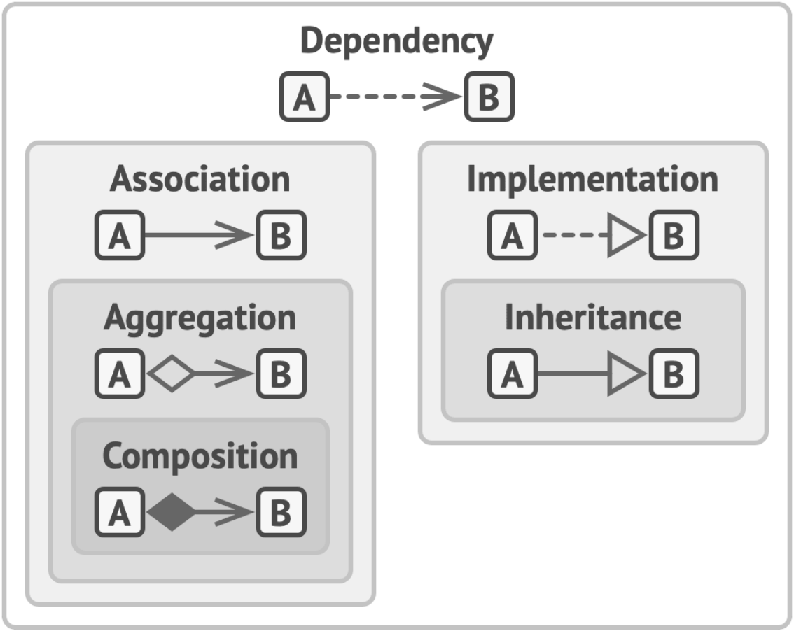

# INTRODUCTION TO OOP
>Kaynak: [refactoring.guru](https://refactoring.guru)

.
.
.

## Pillars of OOP

### 1) Abstraction(Soyutlama)
En basit anlatim ile objenin modellenmesidir. Abstrac Classlar yalnızca belirli bir bağlamda gerçek nesnelerin niteliklerini ve davranışlarını modeller, geri kalanını göz ardı eder.

### 2) Encapsulation(Kapsulleme)
Her nesnenin bir arayuzu vardir, icerisinde yapilan islemleri diger nesnelere sunar. Encapsilation bu arayuzu kurgulamak icin kullanilir, gizlenmesi gerekenler `private` olarak nitelendirir ve gerekli prosedurler ile diger nesnelerden erisilmesini saglar.
>Cogu dildeki `Interface` ve `Abstract Classes/Methods` kavramlari Kapsullemeye baglidir.

### 3) Inheritance (Kalitim)
Nesneler uzerinden yeni nesneler uretmek icin kullanilir.Benzer isi yapan farkli Objeler var ise bir ana nesne altinda farkliliklarina gore kendi methodlarini bulunduran yeni nesneler olusturulur.

Eksi yani yeni uretilen Nesne Turetilen Nesnenin arayuzunu(Interface) bulundurmak zorundadir.

### 4) Polymorphism (Cok Sekillilik)
Nesnenin gercek sinifini kullanarak, kendisinden bagimsiz olarak gercek sinif ozelligini kullanmak icin kullanilir.
> **Gercek Sinif :** Objenin turetildigi ana Obje demektir. OR: Canli sinifindan Insan Sinifi turetilirse Insan'in gercek sinifi Canli olur.

## Relations Between Objects

### Dependency (Bagimlilik)

> _Professor Course Metaryellerine bagimli._

Siniflar arasi en basit ve zayif baglanti sekli. Bir sınıfın tanımında yapılan bazı değişiklikler diğer sınıfta da değişikliklere neden olabiliyorsa iki sınıf arasında bağımlılık vardır.

### Association (İlişkilendirme)

> _Professor Student ile iletisim sagliyor._

Genel olarak, başka bir nesneyi içeren bir alanı temsil etmek için bir ilişkilendirme kullanırsınız. Bu alan iki nesne arasında bir bağlantı görevi görür. Ancak her zaman bir alan olmak zorunda değildir. İlişkilendirme, bir nesne döndüren bir yöntemle de temsil edilebilir. Aksi takdirde, arayüzler arasında ilişkilendirme kullanmak mümkün olmazdı (arayüzlerde alan olmadığı için).

### Aggregation (Kümeleme)

> _Department Professor iceriyor._

kümeleme, birden fazla nesne arasındaki "bire-çok", "çoğa-çok" veya "bütün-parça" ilişkilerini temsil eden özel bir ilişkilendirme türüdür. 

Genellikle, kümeleme altında, bir nesne bir dizi başka nesneye "sahiptir" ve bir kap veya koleksiyon olarak hizmet eder. Bileşen, konteyner olmadan var olabilir ve aynı anda birkaç konteynere bağlanabilir.

### Composition (Kompozisyon)

> _University Departmentlerden olusuyor._

Kompozisyon, bir nesnenin diğerinin bir veya daha fazla örneğinden oluştuğu özel bir toplama türüdür. Bu ilişki ile diğerleri arasındaki fark, bileşenin yalnızca kabın bir parçası olarak var olabilmesidir.

## The Big Picture
Butun iliski cesitlerini gorduk. simdide birlikte nasil baglandigina bakalim.

* **Dependency :** A sinifi B sinifindaki degisikliklerden etkilenir.
* **Association :** A objesi B objesini taniyor. A sinifi B'ye bagli.
* **Aggregation :** A objesi B objesini taniyor ve B'den olusuyor. A sinifi Bye bagli.
* **Composition :** A objesi B objesini taniyor, B'den olusuyor ve B'nin dongusunu yonetiyor. A sinifi B'ye bagli.
* **Implementation :** А sınıfı, B arayüzünde bildirilen yöntemleri tanımlar. A nesneleri B olarak ele alınabilir. A sınıfı B'ye bağlıdır.
* **Inheritance :** A sinifi B'nin arayuzu dahil butun methodlarini tanimlar ve genisletebilir. A nesneleri B olarak ele alınabilir. A sınıfı B'ye bağlıdır.

> _Zayiftan Gucluye dogru Obje ve sinif iliskileri._

# INTRODUCTION TO PATTERNS

## What's a Design Pattern?
Design Patternlar, yazılım tasarımında yaygın olarak ortaya çıkan sorunlara yönelik tipik çözümlerdir. Kodunuzda yinelenen bir tasarım sorununu çözmek için özelleştirebileceğiniz önceden hazırlanmış planlar gibidirler.

Patternlar genellikle algoritmalarla karıştırılır, çünkü her iki kavram da bilinen bazı sorunlara yönelik tipik çözümleri tanımlar. Bir algoritma her zaman bir hedefe ulaşabilecek net bir dizi eylem tanımlarken, bir pattern bir çözümün daha üst düzey bir tanımıdır.

### What does the pattern consist of?
Çoğu pattern, insanların bunları birçok bağlamda yeniden üretebilmesi için çok resmi bir şekilde tanımlanmıştır. Pattern aciklamalari genellikle su sekilde yapilir:

- **Amac**, hem sorunu hem de çözümü kısaca açıklamaktadır.
- **Motivasyon**, sorunu ve patternin mümkün kıldığı çözümü daha da açıklar.
- **Sınıfların yapısı**, patternin her bir parçasını ve bunların nasıl ilişkili olduğunu gösterir.
- **Kod örneği**, patternin arkasındaki fikri kavramayı kolaylaştırır.

### Classification of patterns
Design Patternlar karmaşıklıklarına, ayrıntı düzeylerine ve tasarlanan sistemin tamamına uygulanabilirlik ölçeğine göre farklılık gösterir.

En temel ve düşük seviyeli patternlar genellikle `Idiom` olarak adlandırılır. Genellikle yalnızca tek bir programlama dili için geçerlidirler. En evrensel ve üst düzey patternlar mimari patternlardır. Geliştiriciler bu patternlati hemen hemen her dilde uygulayabilir. Diğer patternların aksine, tüm bir uygulamanın mimarisini tasarlamak için kullanılabilirler.

Buna ek olarak, tüm patternlar niyetlerine veya amaçlarına göre kategorize edilebilir. Bu kitap üç ana pattern grubunu kapsamaktadır:
- **Creational patterns**(Yaratım patternları), esnekliği ve mevcut kodun yeniden kullanımını artıran nesne yaratma mekanizmaları sağlar.
- **Structural patterns**(Yapısal patternlar), nesnelerin ve sınıfların daha büyük yapılar halinde nasıl bir araya getirileceğini ve bu yapıların esnek ve verimli tutulacağını açıklar.
- **Behavioral patterns**(Davranış patternları), etkili iletişim ve nesneler arasında sorumlulukların atanması ile ilgilenir.

# SOFTWARE DESIGN PRINCIPLES
